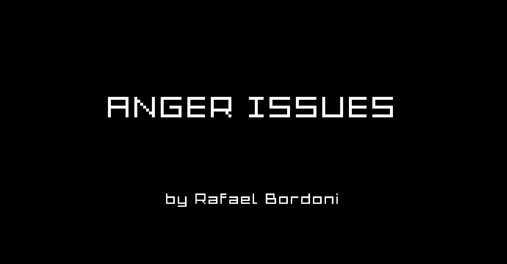
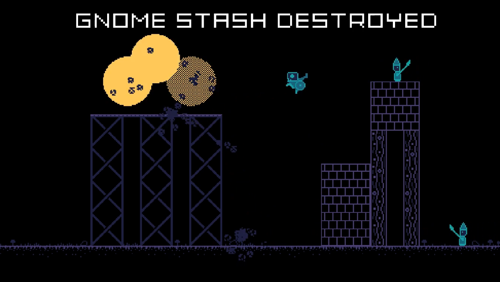
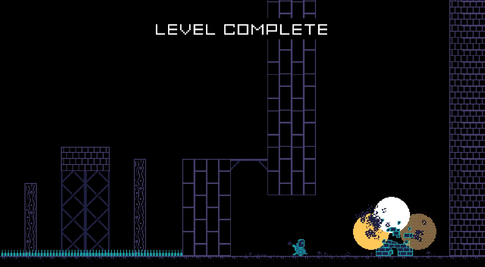

# Anger Issues

Game submission for the [Acerola Jam 0](https://itch.io/jam/acerola-jam-0) game jam. It's a platformer without a jump! The theme of the game jam was __aberration__, and I thought a platformer with no jump is an aberration in of itself. You can download the game on its [itch.io page](https://eldskald.itch.io/anger-issues).

It's a game about a very angry goblin chucking bombs and exploding everything, including himself!

It was built with Godot 4.2.1, so if you want to download and build a version exactly like these ones, just download it and export the project from the engine.

## Credits

Me, [Rafael Bordoni](https://github.com/eldskald), did the code and the project in the [Godot Engine](https://godotengine.org/). I also used [Aseprite](https://www.aseprite.org/) to make the art and [rFXGen](https://raylibtech.itch.io/rfxgen) to make the sound effects.

The music is by [Juhani Junkala](https://www.youtube.com/watch?v=dbACpSy9FWY), and the font is by [Nikos Giannakopoulos](https://www.dafont.com/nikos-giannakopoulos.d1346).

## License

The source code is licensed under [MIT](https://opensource.org/license/MIT), the art and music is [CC0](https://creativecommons.org/public-domain/cc0/) while the font is [CC BY-ND 2.5](https://creativecommons.org/licenses/by-nd/2.5/). More details on license files.
